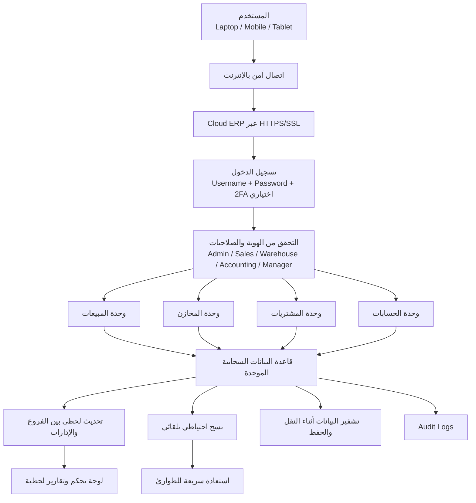
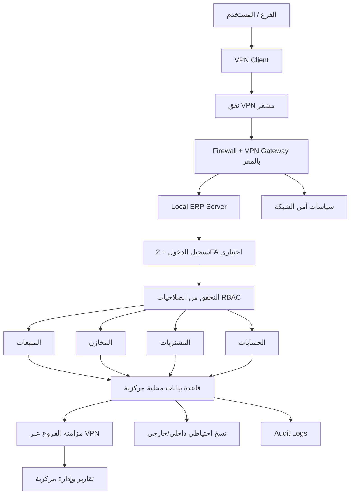

# ملف موحّد: خطتا تشغيل ERP (Cloud + Local Server with VPN)

> هذا الملف يدمج ويُنظّم محتوى الخطتين في وثيقة واحدة شاملة، مع إضافة:
> 1) **التكلفة النهائية التقديرية** لخطة Cloud (استضافة متوسطة + دومين)
> 2) **الأجهزة المطلوبة** لخطة VPN مع **سعر تقريبي بالسوق المصري**

---

## 1) الملخص التنفيذي

يوجد نموذجان لتشغيل نظام ERP متعدد الفروع:

- **الخطة A — Cloud ERP:** النظام مستضاف سحابيًا، وكل الفروع تصل عبر الإنترنت.
- **الخطة B — Local Server + VPN:** النظام داخل مقر الشركة، والفروع ترتبط عبر VPN مشفّر.

الخدمتان تقدمان نفس الوحدات الأساسية:
- المبيعات
- المخازن
- المشتريات
- الحسابات
- إدارة العملاء
- التقارير ولوحات المتابعة
- إدارة المستخدمين والصلاحيات

---

## 2) مقارنة سريعة بين الخطتين

| البند | Cloud ERP | Local + VPN |
|---|---|---|
| مكان البيانات | سحابي عند مزود خدمة | داخل الشركة (On-Premises) |
| الوصول | من أي مكان عبر الإنترنت | عبر الشبكة الداخلية أو VPN |
| التوسع | أسهل وأسرع | يحتاج توسعة عتاد وشبكات |
| تكلفة البداية | أقل غالبًا | أعلى (شراء أجهزة) |
| التكلفة الشهرية | مستمرة (اشتراك + خدمات) | إنترنت + صيانة + تجديدات |
| التحكم في البيانات | جيد لكن عند مزود خارجي | أعلى تحكم داخلي |
| الاعتماد على الإنترنت | مرتفع | متوسط (مرتفع للفروع) |

---

## 3) خطة A: Cloud ERP — Workflow موحد

### 3.1 الرسم التشغيلي

### 3.2 مراحل التشغيل
1. دخول آمن (HTTPS + حسابات مستخدمين + 2FA اختياري).
2. تطبيق RBAC للصلاحيات حسب الدور.
3. تشغيل يومي لوحدات ERP المختلفة.
4. تحديث لحظي للبيانات بين الفروع.
5. تقارير فورية للإدارة.
6. نسخ احتياطي، تشفير، وخطة تعافي.

### 3.3 عناصر البنية الفنية المقترحة
- Cloud App Server
- Cloud Database (Replica اختياري)
- Object Storage
- IAM
- Monitoring/Alerts
- WAF + Rate Limiting + Secrets Management

### 3.4 تقدير التكلفة — **الخطة المتوسطة + الدومين (نهائي شهري/سنوي)**

> **افتراض الخطة المتوسطة:** VPS/Cloud instance بمواصفات تقريبية 4 vCPU + 6~8GB RAM + SSD مناسب + Backup أساسي.

#### أ) تكلفة الاستضافة المتوسطة (تقديري)
- أمثلة أسعار محلية معروضة في السوق المصري تشير لمدى تقريبي من **700 EGP إلى 6,300 EGP شهريًا** حسب المزود، الإدارة (Managed/Unmanaged)، ومواصفات الخدمة/الدعم.

#### ب) تكلفة الدومين
- نطاقات محلية مثل `.com.eg` معروضة قرابة **899 EGP سنويًا** في بعض العروض.
- بديل عالمي `.com` عادة أرخص سنويًا (بالدولار) لكن يتأثر بسعر الصرف وبوابة الدفع.

#### ج) التكلفة النهائية المقترحة (عملية لاتخاذ القرار)
- **سيناريو اقتصادي (Unmanaged / مقدم محلي اقتصادي):**
  - استضافة: 700 × 12 = **8,400 EGP/سنة**
  - دومين: **~899 EGP/سنة**
  - **الإجمالي السنوي: ~9,299 EGP**

- **سيناريو متوسط متوازن (الموصى به لمعظم الشركات الصغيرة/المتوسطة):**
  - استضافة: نطاق واقعي **1,500 إلى 2,500 EGP/شهر**
  - سنويًا: **18,000 إلى 30,000 EGP**
  - دومين: **~899 EGP/سنة**
  - **الإجمالي السنوي: ~18,899 إلى 30,899 EGP**
  - **الإجمالي الشهري المكافئ: ~1,575 إلى 2,575 EGP**

- **سيناريو أعلى (موارد أعلى/دعم أقوى):**
  - استضافة حتى **~6,300 EGP/شهر**
  - سنويًا: **75,600 EGP** + دومين 899
  - **الإجمالي السنوي: ~76,499 EGP**

> ملاحظة: الأسعار تقديرية ومتغيرة حسب العروض، الضريبة، وسعر الدولار.

### 3.5 مزايا وقيود Cloud
**المزايا:**
- مرونة عالية والوصول من أي مكان.
- سرعة التوسع.
- تشغيل مركزي وتحديثات أسهل.

**القيود:**
- اعتماد كبير على الإنترنت.
- اشتراكات تشغيل مستمرة.
- حوكمة بيانات واضحة مع مزود الخدمة.

---

## 4) خطة B: Local Server + VPN — Workflow موحد

### 4.1 الرسم التشغيلي

### 4.2 مراحل التشغيل
1. تجهيز السيرفرات بالمقر (ERP + DB).
2. إعداد Firewall وVPN Gateway.
3. ربط الفروع (Site-to-Site أو Remote Access).
4. تطبيق الصلاحيات وتشغيل الوحدات.
5. مزامنة مركزية وتأمين واسترجاع.

### 4.3 عناصر البنية الفنية المقترحة
- Local App Server
- Local DB Server (Replica اختياري)
- Firewall/VPN Appliance
- AD/LDAP أو IAM داخلي
- SIEM/Log Server
- Monitoring لشبكة وسيرفرات الداخل

### 4.4 الأجهزة المطلوبة لخطة VPN + سعر تقريبي في السوق المصري

> **الهدف:** تشغيل ERP محلي لعدة فروع مع أمان جيد وتوافر مقبول.

#### الحد الأدنى العملي (SMB)
1. **Server رئيسي (Rack/Tower)**
   - نطاق سعري تقريبي: **50,000 إلى 220,000 EGP**
   - يختلف بشدة حسب الجيل (جديد/مستعمل)، CPU/RAM/Storage.

2. **Firewall / VPN Appliance (مثل FortiGate 60F فئة SMB)**
   - نطاق تقريبي: **~31,000 EGP** (وقد يزيد مع الرخص والدعم).

3. **UPS Online مناسب للسيرفر والشبكة**
   - نطاق تقريبي: **15,000 إلى 40,000 EGP** حسب السعة والزمن.

4. **Managed Switch جيجابت (24 منفذ غالبًا)**
   - نطاق تقريبي: **8,000 إلى 25,000 EGP** حسب الماركة والمزايا.

5. **NAS أو وحدة Backup خارجية**
   - نطاق تقريبي: **20,000 إلى 60,000 EGP** (بدون/مع أقراص حسب السعة).

6. **اكسسوارات البنية** (Rack/Cabling/PDU/تهوية أساسية)
   - نطاق تقريبي: **10,000 إلى 35,000 EGP**.

#### إجمالي استثماري تقريبي لخطة VPN (مرة واحدة)
- **حد اقتصادي:** ~**134,000 EGP**
- **حد متوسط شائع:** ~**220,000 إلى 320,000 EGP**
- **حد أعلى (توافر أعلى ومكونات أقوى):** قد يتجاوز **400,000 EGP**

> لا يشمل ما سبق: التراخيص البرمجية، عقد الدعم السنوي، تكاليف التركيب الاحترافي، والضريبة.

### 4.5 مزايا وقيود Local + VPN
**المزايا:**
- تحكم أكبر بالبيانات والسياسات.
- أداء ممتاز داخل الشبكة المحلية.
- مناسب للقطاعات المقيدة سحابيًا.

**القيود:**
- CAPEX أعلى بالبداية.
- حاجة لفريق IT وتشغيل مستمر.
- حساسية أعلى لأي عطل مركزي بدون HA/DR جيد.

---

## 5) توصية عملية سريعة

- لو تريد **بدء أسرع وتكلفة تأسيس أقل**: ابدأ بـ **Cloud** بخطة متوسطة متوازنة.
- لو أولوية الشركة **سيادة البيانات الداخلية والامتثال الصارم**: استخدم **Local + VPN** مع استثمار بنية قوي.

---

## 6) مصادر الأسعار المرجعية المستخدمة (للتحقق فقط)
- VPS محلي (نطاقات سعرية في مصر):
  - https://noxhost.net/vps-hosting/
  - https://egphp.com/dedicated.php
- دومين محلي (.com.eg):
  - https://techtitan.com.eg/en/domains/
- أسعار سيرفرات (عينات من السوق المصري):
  - https://igfi.me/product/dell-poweredge-emc-r740-16-bay-sff-rack-server-2/
  - https://is-eg.net/product/dell-poweredge-t440-server-intel-xeon-silver-4210r-2-2g-10c/ 
  - https://top10-eg.com/product/dell-poweredge-r730xd/
- Firewall/VPN (FortiGate 60F - عرض سوقي):
  - https://www.serverbasket.net/eg/p/fortigate-60f-series-firewall/

> تم استخدام هذه الروابط لبناء **تقديرات تقريبية** وليست عروض أسعار نهائية.
